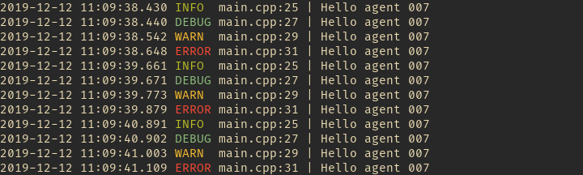

# vex_logger

- simple
- tiny
- header only logger

copy the logger.h in your project and use.  
as default all logged are written to /tmp/vex_log.txt;

## How to use

```cpp
log_info("Hello agent %s", "007");
log_warn("Hello agent %s", "007");
log_debug("Hello agent %s", "007");
log_error("Hello agent %s", "007");

// to append instead of overwritting
log_append();
// to set your own output path
log_output("/home/myuser/my_log.txt");

```

## Showcase


