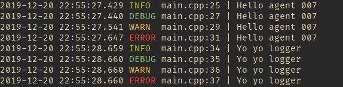

# vex_logger

- simple
- tiny
- nothing fancy
- thread safe
- header only logger

copy the vex_logger.h in your project and use, as default all logs are written to /tmp/vex_log.txt;

## How to use

```cpp
// logs with string format:
log_infof("Hello agent %s", "007");
log_warnf("Hello agent %s", "007");
log_debugf("Hello agent %s", "007");
log_errorf("Hello agent %s", "007");

//log with single string
log_info("Yo yo logger");
log_debug("Yo yo logger");
log_warn("Yo yo logger");
log_error("Yo yo logger");

// to append instead of overwritting the log file
log_append(true);

// to set your own output path
log_output("/home/myuser/my_log.txt");

// filter logs
log_filter("info", "error", "warn");

// remove filter if added
log_remove_filter("info", "warn");

```

## Showcase

